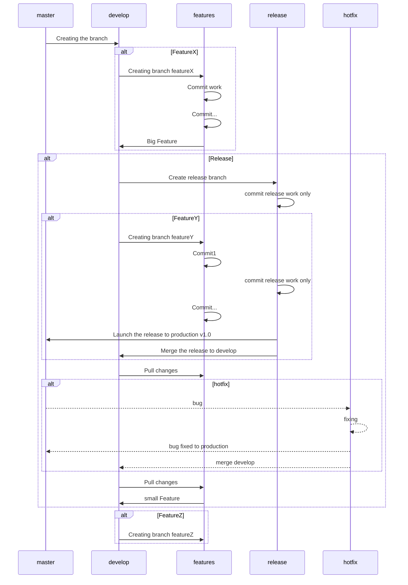

# Table Of Content
[ToC]
# Introduction
**Classa** App Project follow a specific workflow :sparkles:, besides conventional commits messages. <br/> They are all presented in this document alongside with resources for more explanation :rocket:. ==Use this document as your **Go To** Reference :bookmark_tabs:.==

###### Note!


> You're allowed to make a copy of this workflow.md and modify it as you please :stars:<i class="fa fa-share-alt"></i>

# :memo: GitFlow


<p style="text-align: center"><a href="https://iamchuka.com/content/images/2018/05/gitflowimage.png">Image Source</a></p>
    
## General Explanation

- There are two main branches throughout the software development **master** && **develop**
  > ==Develeop== serves for features integration, contains all the history of the project. <br/>  ==Master== is the official production software contains only some specific versions. [color=#3b75c6]
- **Feature**: these branches are specific focused branches that implement a certain feature
- **Release**: they prepare for big features release to production, or predetermined schedule releases
    > **Release and Feature** are both  ==forked off develop== 
    > **Feature** never interact with master
    > **Release** :
    >  :crossed_swords: ==Never contains new features==, it contains bug fixes, documentation and other release relation things.
    >  :package: if there are big bug fixes, then they should be let for the next release  
    >  :rocket: Once Release is ready, it's merged to both develop and **master** with a **version number** [color=#6ceec6]
- **Hotfix** Branches are specific for version patches, that fixes bugs that happened after a release and they are **forked of master**
    > We can merge after bug fixes to **develop** and **master** , or add the fixes to the next soon release that is currently on progress.[color=#ff1055]
## Diagram Example
**UML**

<p style="text-align: center">Diagram1. Representing a general example of <span style="color:darkblue; font-weight:bold">GitFlow</span></p>


## Resources

| Ressource         | Source                           |
| ----------------- |:---------------------------------|
| Gitflow Workflow  | :link: [Atlassian BitBucket]     |
| git-flow Documentation  | :link: [GitFlow Doc release v1.0]|
| danielkummer  | :link: [GitFlow cheatsheet] |

[Atlassian BitBucket]: https://www.atlassian.com/git/tutorials/comparing-workflows/gitflow-workflow
[GitFlow Doc release v1.0]: https://readthedocs.org/projects/git-flow/downloads/pdf/latest/
[GitFlow cheatsheet]: https://danielkummer.github.io/git-flow-cheatsheet/


<p style="text-align:center;"><a href="https://www.youtube.com/watch?v=BF2OHMM86Ik&list=PL5Zfvlv-5-QrHl2CVM9KNC5mP1ymaBgk&index=1">GitFlow CrashCourse</a></p>

# Project Git Convention
## Commit messages
### 1. General squelleton
The general squeletton of the commits is as follows: 
```
type[(optional scope)]: <description> 
``` 
### 2. Type

Type can take one of these:

**fix**: patching a bug (semantic versioning).
**feat**: commit related to a feature.
**BREAKING CHANGE**: a commit that has a footer BREAKING CHANGE:, or appends a ! after the type/scope, introduces a breaking API change.It can be part of commits of any type.
**build**: for the code in production, related to building it in the server. 
**docs**: commit related for adding and creating documentatino.
**style**: For any style related change.
**refactor**: any refactor change.
**test**: Test related things.
**chore**: regular code maintainance.
**others**: that aren't related the one already wrote.

:::info
:paperclip: example
```
fix(license): change the year of copyright
```
:::
### 3. Optional scope

- If necessary, it may refer to any feature branch, or any additional contextual information and is contained within paranthesis
- For Long naming they should be separated by a hyphen
```
feat(parser): add ability to parse arrays.
```
### 4. Description

For the description it refers to the changes done according to the type of commit for further information and is ==mandatory==
- Try to wrap it around **50 characters** or less
- For more information the structure should be
```
subject 
{empty line}
contextual information
```
:::info
- Be as consice as possible and explain the ==what changed and why== and not the **how**
- Bullet points, hanging indent, asterisk, hyphen with single spaces used for bullets are allowed in the contextual information
- Contextual information, should have independant information separated by an empty line
:::

:::success
:bulb: ***example***
```
feat(navigation-dropdown): Add the toggler dropdown

The toggle is for when the screen get small

The reason is because for smaller screens (<600px) the links are too big and have bad rendering
```
:::
## Few Conventions/Tips
- Branches naming are separated by a hyphen ```test-dev```, for features the conventions is ```feat-<nameOfFeature>```
- Pull Request subjects may or may not have an issue for them, for those that are concerned by an issue linking the issue as a subject for this PR. Those that doesn't have an issue can be 
- Messages in description should be in imperative ```fix(connection): correct the link for connection``` we use ```correct``` not ```corrected, correcting or corrects```
## Resources

| Ressource           |  Source                          |
| ------------------- |:---------------------------------|
| How to Write a Git Commit Message | :link: [Atlassian BitBucket]|
| Datree github       |  :link: [GitHub Best Practices]  |
| Wiki Github         | :link: [Wiki best practices]     |
| Conventional commit | :link: [Conventional commits]    |


[Chris Beams]: https://chris.beams.io/posts/git-commit/
[GitHub Best Practices]: https://www.datree.io/resources/github-best-practices
[Wiki best practices]: https://github.com/trein/dev-best-practices/wiki/Git-Commit-Best-Practices
[Wiki best practices]: https://github.com/trein/dev-best-practices/wiki/Git-Commit-Best-Practices
[Conventional commits]:
https://www.conventionalcommits.org/en/v1.0.0/
:::info
